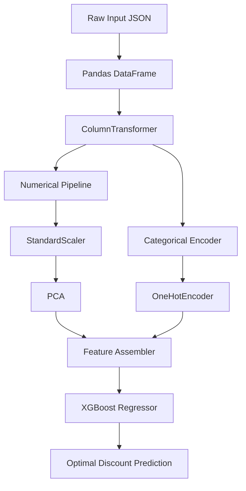

# Superstore Discount Calculator — Master Documentation

An advanced, flat corporate-style decision support calculator that uses a trained scikit-learn preprocessing pipeline and an XGBoost Regressor model (`model.pkl`) to calculate optimal order discounts.

---

## 📖 Table of Contents
1. [Business Value & Goal](#1-business-value--goal)
2. [Dataset Overview](#2-dataset-overview)
3. [Machine Learning Pipeline (`model.pkl`)](#3-machine-learning-pipeline-modelpkl)
4. [Application Architecture](#4-application-architecture)
5. [Directory Structure](#5-directory-structure)
6. [Installation & Local Run](#6-installation--local-run)

---

## 1. Business Value & Goal

In retail operations, offering discounts is a delicate balancing act. Over-discounting erodes profit margins, while under-discounting can result in lost sales volume or customer churn. 

This tool serves as an **AI-driven decision support system** for sales managers. By inputting logistics, geographic destination, category, and desired transaction numbers, the AI model calculates the historically expected discount level. This helps prevent margins from slipping into unprofitable territories.

---

## 2. Dataset Overview

The model is trained on the standard **Superstore Dataset** (`Sample - Superstore.csv`). The pipeline reads the following columns as input features:

### Categorical Columns
*   **Ship Mode:** `Standard Class`, `Second Class`, `First Class`, `Same Day` (Affects urgency and delivery overheads).
*   **Segment:** `Consumer`, `Corporate`, `Home Office` (Identifies buyer demographic and scale).
*   **Region:** `Central`, `East`, `South`, `West` (Geographic shipping region).
*   **State & City:** Geographic metrics containing 49 unique US states and 531 unique cities (Impacts local taxation, distribution costs, and logistics).
*   **Category:** `Furniture`, `Office Supplies`, `Technology` (Defines high-level product margins).
*   **Sub-Category:** 17 unique values including `Bookcases`, `Appliances`, `Phones`, etc. (Granular product identification).

### Numerical Columns
*   **Sales ($):** Total transaction value before discount.
*   **Quantity:** Count of items ordered.
*   **Profit ($):** Net profit earned from the sale.

---

## 3. Machine Learning Pipeline (`model.pkl`)

The model is stored as a serialized scikit-learn `Pipeline` object consisting of two distinct stages: a preprocessor and a regression estimator.



### Stage 1: Preprocessor (`ColumnTransformer`)
Features are separated by data types and sent through distinct preprocessing paths:
*   **Numerical Path (`num`):**
    1.  **`StandardScaler`:** Standardizes numeric columns (`Sales`, `Quantity`, `Profit`) by centering the mean to `0` and scaling the standard deviation to `1`.
    2.  **`PCA` (Principal Component Analysis):** Reduces dimensionality to simplify collinear numerical features down to components.
*   **Categorical Path (`cat`):**
    1.  **`OneHotEncoder`:** Encodes nominal text fields (like `Ship Mode`, `Segment`, `City`, etc.) into sparse binary columns, ignoring unknown labels safely.

### Stage 2: Predictor (`XGBRegressor`)
The processed feature array is fed into a trained **Extreme Gradient Boosting Regressor** (`XGBRegressor`). 
*   **Algorithm:** Gradient Boosted Decision Trees configured with 200 estimators and a max tree depth of 7 to model non-linear interactions between profit, category, and discounts.

---

## 4. Application Architecture

To keep the codebase streamlined and lightweight, the application consists of two main active files:

### Backend Server (`app.py`)
A Python Flask backend that:
*   Loads `model.pkl` globally once at startup for instant model response.
*   Exposes a POST `/predict` API endpoint to parse, validate type structures, and run model predictions on dataframes.
*   Serves the main HTML template.

### Unified Frontend UI (`templates/index.html`)
The entire user interface, visual styling, and interaction logic are consolidated into **under 250 lines of code** inside `index.html`:
*   **HTML Structure:** Defines the form inputs (logistics, destination, product details, financials) and output display panels.
*   **CSS Styles (Inline `<style>`):** Implements a clean, flat corporate theme, with comfortable spacing, slate-colored text variables, and solid colors (no heavy neon effects or glows).
*   **JavaScript (Inline `<script>`):** 
    *   Loads states and cities dynamically on page load using a local static JSON file.
    *   Ensures category-to-subcategory dropdown validation consistency.
    *   Asynchronously fetches calculations from the `/predict` API without reloading.
    *   Displays sales margins and warning messages based on profit numbers.

---

## 5. Directory Structure

The project has been refactored to minimize the number of files:

```text
Superstore/
│
├── app.py                     # Flask server file (loads model, handles routing and predictions API)
├── model.pkl                  # Trained Machine Learning pipeline (XGBoost Regressor + ColumnTransformer)
├── Sample - Superstore.csv    # Raw dataset log file
├── Superstore.ipynb           # Original analysis and libraries setup notebook
├── README.md                  # Detailed project guide (This file)
│
├── templates/
│   └── index.html             # Consolidated frontend UI (HTML + CSS Styles + JavaScript Script)
│
└── static/
    └── state_city_map.json    # Pre-compiled mapping linking states to unique cities
```

---

## 6. Installation & Local Run

### Installation
1. Ensure you have Python installed.
2. Install the server package:
    ```bash
    pip install flask
    ```

### Running the App
1. Open your terminal in the directory where `app.py` resides.
2. Start Flask:
    ```bash
    python app.py
    ```
3. Open `http://127.0.0.1:5000` in your web browser.

### Troubleshooting
*   **`ModuleNotFoundError: No module named 'xgboost'`:** Ensure all machine learning packages are installed locally in your environment:
    ```bash
    pip install pandas scikit-learn xgboost
    ```
*   **Port 5000 already in use:** If port 5000 is occupied, you can change the port parameter at the bottom of `app.py`:
    ```python
    app.run(debug=True, host='127.0.0.1', port=5001)
    ```
